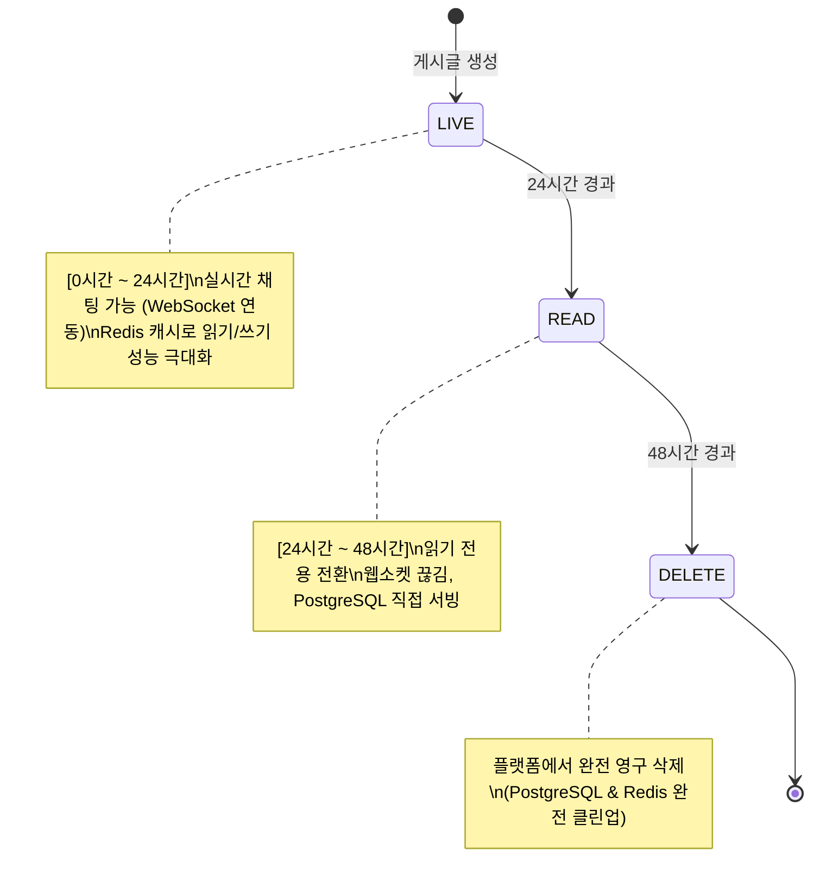
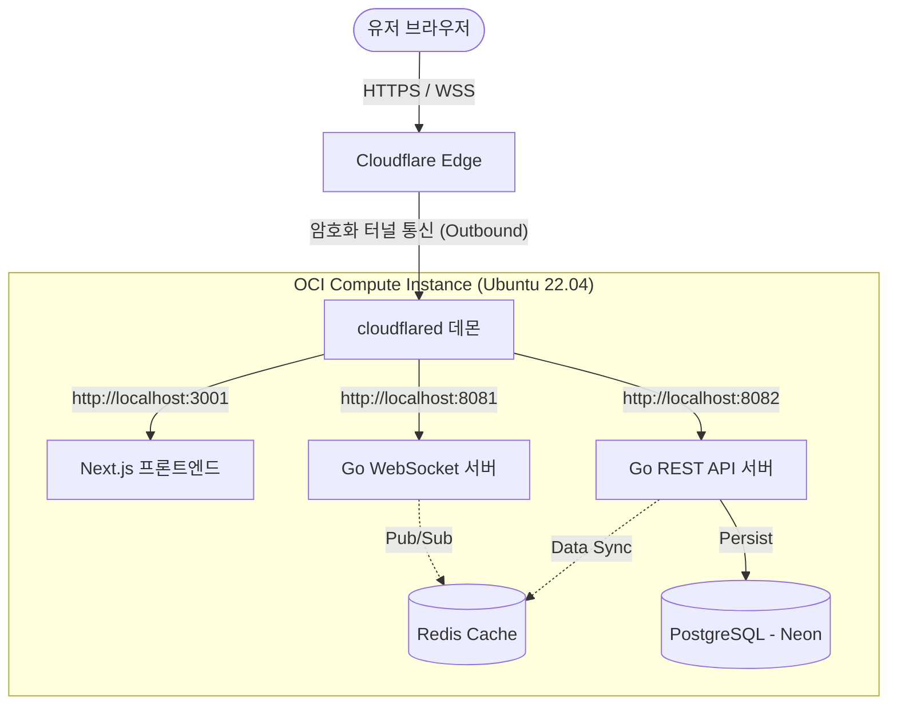

# ⏱️ 버즈48 (Buzz48) — 48시간 타임어택 실시간 익명 커뮤니티

> **"지금 참여하지 않으면 영원히 사라집니다."**  
> 게시글이 즉시 채팅방이 되어 48시간 동안만 생존하고 폭파되는 초단기 실시간 커뮤니티 플랫폼입니다.

<br>

## 🚀 프로젝트 개요
* **기획 배경:** 휘발성 소통을 선호하는 현대 트렌드에 맞춰, 정보의 유효기간(48시간)을 극도로 제한해 소통의 밀도를 높이고 참여를 극대화하는 실시간 커뮤니티입니다.
* **핵심 기능:** 
  - **UUID 기반의 초간편 익명 세션**: 별도 회원가입 없이 접속 시 자동 랜덤 닉네임 부여
  - **실시간 소통 & 리액션**: WebSocket 기반의 초고속 실시간 채팅 및 이모지 반응 기능
  - **인메모리 캐시 스코어링**: 동접자, 채팅 수, 리액션을 가중치 계산하여 10초마다 실시간 인기(HOT) 글 랭킹 정렬

<br>

## 🛠️ 기술 스택 (Tech Stack)

### Frontend
<p>
  
  
  
  
</p>

### Backend
<p>
  
  
  
  
  
</p>

### Infrastructure & DevOps
<p>
  
  
  
</p>

<br>

## ⏳ 핵심 비즈니스 로직 & 라이프사이클
게시글의 생성부터 소멸까지의 주기는 48시간으로 한정되며, **시간 기준(created_at)**으로 서비스 레이어가 동적으로 상태를 판별합니다.



<br>

## 🌐 시스템 아키텍처 (System Architecture)
보안성 및 운영 효율을 극대화하기 위해 **Cloudflare Tunnel(Zero Trust)**을 구축하여 오라클 클라우드 VM 인스턴스의 인바운드 포트를 완전 폐쇄한 구조로 설계했습니다.



<br>

## 🛠️ 기술적 해결 및 성과 (Troubleshooting)

### 1. CORS 차단 및 호스트 하드코딩 리팩토링으로 배포 안정성 확보
* **문제 상황:** 프론트엔드 코드 내부에 API 주소 및 WebSocket 접속 주소가 `localhost:8082`, `localhost:8083`으로 하드코딩되어 있어, 실제 운영 도메인(`https://buzz48.pl3.kr`) 배포 시 브라우저가 사용자 자신의 로컬PC를 바라보며 통신 장애 및 CORS 차단 에러를 유발하는 치명적인 구조였습니다.
* **해결 방안:** 
  - 백엔드(`config.go`, `main.go`)에서 하드코딩되었던 허용 출처 설정을 `CORS_ALLOW_ORIGINS` 환경변수로 주입받도록 리팩토링했습니다.
  - 프론트엔드 API 클라이언트(`api.ts`)와 웹소켓 훅(`useWebSocket.ts`) 내부 주소를 `NEXT_PUBLIC_*` 빌드타임 환경변수를 동적으로 연동하도록 변경했습니다.
  - 로컬 개발 환경과의 호환성을 고려해 환경변수가 비어있을 시 기존 로컬 주소로 자동 복귀(Fallback)하는 유연성을 설계했습니다.
* **결과:** OCI VM 운영 환경 배포 시 어떠한 코드 수정이나 CORS 오류 없이 도메인 기반의 실시간 배포에 성공했습니다.

### 2. Cloudflare Tunnel 구축으로 클라우드 인프라 보안 극대화
* **문제 상황:** 일반적인 HTTPS 및 WSS 포트를 열기 위해 방화벽(80, 443 등)을 열어둘 경우, 외부 공격(DDoS, 포트 스캔)의 타겟이 되어 보안 리스크가 상승했습니다.
* **해결 방안:** OCI 방화벽의 인바운드 포트를 **전부 차단**하고, 서버 내부에서 아웃바운드로 통신을 개설하는 `cloudflared` 데몬을 설치하여 보안 터널을 구성했습니다.
* **결과:** 외부 포트 오픈 없이 온전한 2중 SSL 보안(WSS, HTTPS) 통신 경로를 단일 Tunnel로 확보하여 최상급 보안 환경을 완성했습니다.

### 3. 로컬/운영 간 포트 포워딩 경로 불일치 및 웹소켓 UUID 파싱 에러 해결
* **문제 상황:** 
  - Cloudflare Origin Rules를 통해 `/ws` 경로로 들어오는 웹소켓 트래픽을 백엔드 웹소켓 서버(8081)로 넘겨주는 구조에서, 오리진에 전달될 때 원래 경로인 `/ws/posts/UUID` 형태로 그대로 전달되었습니다.
  - 하지만 백엔드 웹소켓 서버(`wsHandler`) 내부에 `/v1/ws/posts/` (13글자) 경로 접두사를 기준으로 고정해서 postID를 잘라내는 로직이 하드코딩되어 있어, 운영 배포 시 UUID의 앞부분이 엉뚱하게 잘려나간 비정상적인 ID를 파싱해 404 에러와 함께 웹소켓 연결이 지속해서 강제 종료되는 치명적인 장애가 일어났습니다.
* **해결 방안:** 
  - 웹소켓 서버(`ws/main.go`)의 라우팅 경로에 `/ws/posts/` 등 여러 우회 경로를 수용하도록 다중 매핑을 등록했습니다.
  - 고정된 문자열 슬라이싱 대신, Go 표준 라이브러리인 `"path"`의 `path.Base(r.URL.Path)`를 사용하여 유입 경로의 형태와 무관하게 가장 끝의 UUID 세그먼트만 동적으로 안전하게 파싱하도록 코드를 전면 리팩토링했습니다.
* **결과:** 로컬 개발(`ws://localhost:8083/v1/ws/posts/...`)과 상용 도메인 배포(`wss://buzz48.pl3.kr/ws/posts/...`) 양쪽 환경 모두에서 일절 코드 수정 없이 실시간 웹소켓 통신이 완벽하게 정상 동작하도록 호환성을 확보했습니다.

<br>

## 📂 디렉토리 구조 (Directory Structure)
```
buzz48/
├── backend/            # Go REST API & WebSocket Server
│   ├── api/            # API 서버 메인 엔트리
│   ├── ws/             # WebSocket 서버 메인 엔트리
│   ├── cmd/            # 배치 워커 및 유틸리티 CLI
│   └── internal/       # 비즈니스 로직, 데이터베이스, 웹소켓 헙 모듈
├── frontend/           # Next.js SPA
│   ├── public/         # 정적 리소스
│   └── src/            # Components, Hooks, API 라이브러리 소스
├── docs/               # 설계서 및 인프라 운영 안내서 문서 모음
└── .github/workflows/  # GitHub Actions CD 자동화 스크립트
```

<br>

## 💻 로컬 구동 방법 (How to Run Locally)

### 1. 환경 설정 (.env)
`backend/.env` 파일을 작성하고 로컬 포트 및 DB, Redis 연결 정보를 기재합니다.

```env
APP_ENV=development
API_PORT=8082
WS_PORT=8083
CORS_ALLOW_ORIGINS=http://localhost:3000,http://localhost:3001,http://127.0.0.1:3000,http://127.0.0.1:3001

REDIS_HOST=127.0.0.1
REDIS_PORT=6379

DB_HOST=localhost
DB_PORT=5432
DB_NAME=buzz48
DB_USER=postgres
DB_PASSWORD=your_password
DB_SSL_MODE=disable

JWT_SECRET=super_secret_jwt_key_32_characters_long_for_buzz48
```

### 2. 서버 실행

**Backend API & WebSocket 구동**
```bash
cd backend
go run api/main.go   # http://localhost:8082
go run ws/main.go    # ws://localhost:8083
```

**Frontend Next.js 구동**
```bash
cd frontend
npm install
npm run dev -- -p 3001   # http://localhost:3001
```
