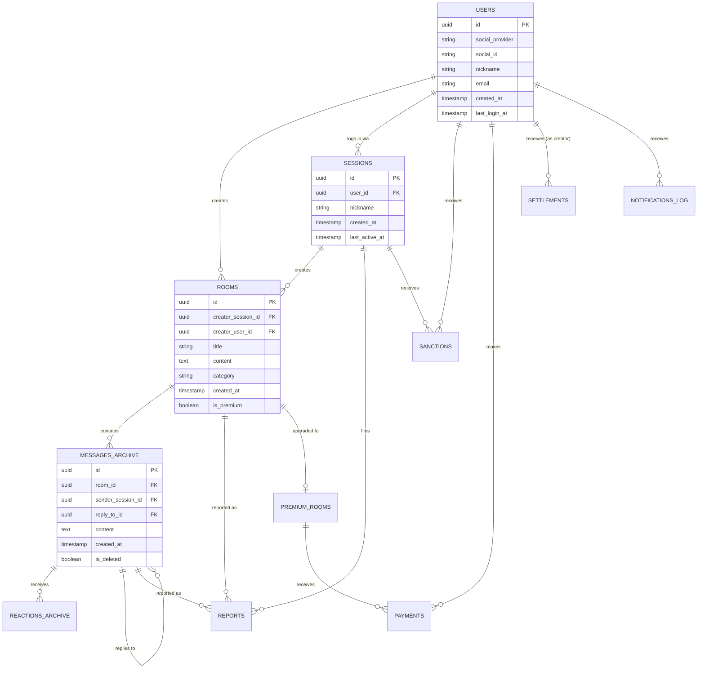

# [DB 설계서] 버즈48 (Buzz48)

> **버전**: v1.0 | **작성일**: 2026-07-03 | **기반 문서**: PRD v1.0, 시스템 아키텍처 설계서 v1.0
> **DB 환경**: 개발/스테이징 — Neon (Serverless PostgreSQL) / 운영 — PostgreSQL(Neon 유료 플랜 또는 AWS RDS로 승급, 스키마 동일)
> **문서 목적**: PostgreSQL 스키마(READ 아카이브·계정·결제·신고)와 Redis 자료구조(LIVE 실시간 데이터)를 모두 정의하여 개발 착수 가능한 수준으로 명세.

---

## 1. 저장소 역할 재확인

아키텍처 문서 §6에서 정의한 이원화 원칙에 따라 이 문서도 두 파트로 나뉩니다.

| 저장소 | 담당 데이터 | 본 문서 구성 |
| :--- | :--- | :--- |
| **Redis** | LIVE 상태(0~24h) 채팅 메시지, 이모지 반응, 동접자 수, HOT 스코어, 세션 캐시, Rate Limit | §5 |
| **PostgreSQL** | 계정, READ 상태로 전환된 메시지 아카이브, 신고/제재, 결제/정산, 알림 로그, IP 로그 | §2~§4 |

---

## 2. ERD (핵심 엔터티)



---

## 3. PostgreSQL 스키마

### 3.1 계정 및 세션

```sql
-- 로그인 유저 (소셜 로그인 연동 시에만 생성)
CREATE TABLE users (
    id              UUID PRIMARY KEY DEFAULT gen_random_uuid(),
    social_provider VARCHAR(20) NOT NULL,        -- 'google' | 'kakao' | 'naver'
    social_id       VARCHAR(100) NOT NULL,
    nickname        VARCHAR(50) NOT NULL,
    email           VARCHAR(255),
    is_creator      BOOLEAN NOT NULL DEFAULT FALSE, -- PRD §9.2 개설자 인증 여부
    creator_verified_at TIMESTAMPTZ,
    created_at      TIMESTAMPTZ NOT NULL DEFAULT now(),
    last_login_at   TIMESTAMPTZ,
    UNIQUE (social_provider, social_id)
);

-- 익명 세션 (모든 유저는 익명 세션에서 출발, 로그인 시 user_id 연결)
CREATE TABLE sessions (
    id              UUID PRIMARY KEY,             -- 클라이언트 발급 UUID v4 그대로 사용
    user_id         UUID REFERENCES users(id) ON DELETE SET NULL,
    nickname        VARCHAR(50) NOT NULL,
    created_at      TIMESTAMPTZ NOT NULL DEFAULT now(),
    last_active_at  TIMESTAMPTZ NOT NULL DEFAULT now()
);
CREATE INDEX idx_sessions_user_id ON sessions(user_id);
CREATE INDEX idx_sessions_last_active ON sessions(last_active_at); -- PRD §1.3 90일 미접속 파기 배치용

-- IP 로그 (개인정보보호법 §5.3, 최대 30일 보관 후 파기)
CREATE TABLE ip_logs (
    id              BIGSERIAL PRIMARY KEY,
    session_id      UUID NOT NULL REFERENCES sessions(id),
    ip_address      INET NOT NULL,
    created_at      TIMESTAMPTZ NOT NULL DEFAULT now()
);
CREATE INDEX idx_ip_logs_created_at ON ip_logs(created_at); -- 30일 TTL 파기 배치 스캔용
```

### 3.2 토론방 및 메시지 아카이브

> **설계 원칙**: `rooms` 테이블에는 방의 상태(LIVE/READ)를 컬럼으로 저장하지 않습니다. 상태는 `created_at` 기준으로 항상 재계산하며(PRD §4.2, 아키텍처 §3.2 이중 검증 원칙), 이를 통해 DB와 애플리케이션 간 상태 불일치 문제를 원천 차단합니다.

메시지는 트래픽이 가장 크게 누적되는 테이블이므로, 아키텍처 문서 §6에서 언급한 대로 **월 단위 시간 기반 파티셔닝**을 적용합니다.

```sql
-- 토론방 (생성 시점 정보만 저장, LIVE 상태 실시간 데이터는 Redis)
CREATE TABLE rooms (
    id                  UUID PRIMARY KEY DEFAULT gen_random_uuid(),
    creator_session_id  UUID NOT NULL REFERENCES sessions(id),
    creator_user_id     UUID REFERENCES users(id),
    title               VARCHAR(100) NOT NULL,
    content             TEXT,
    category            VARCHAR(20) NOT NULL,
    image_urls          TEXT[],
    created_at          TIMESTAMPTZ NOT NULL DEFAULT now(), -- LIFE-02 판정 기준 시각
    is_premium          BOOLEAN NOT NULL DEFAULT FALSE,
    -- state는 저장하지 않음: created_at으로 항상 재계산 (PRD §4.2, 아키텍처 §3.2 이중 검증 원칙)
    archived_to_pg_at   TIMESTAMPTZ  -- LIVE→READ 전환 시 Redis→PG 이관 완료 시각 (정합성 확인용)
);
CREATE INDEX idx_rooms_category_created ON rooms(category, created_at DESC);
CREATE INDEX idx_rooms_created_at ON rooms(created_at); -- Lifecycle/Purge Worker 스캔용

-- 메시지 아카이브 (월별 파티션. created_at 기준)
CREATE TABLE messages_archive (
    id                  UUID NOT NULL DEFAULT gen_random_uuid(),
    room_id             UUID NOT NULL REFERENCES rooms(id),
    sender_session_id   UUID NOT NULL REFERENCES sessions(id),
    reply_to_id         UUID,                   -- 자기참조, FK는 파티션 특성상 애플리케이션 레벨 검증
    content             TEXT NOT NULL,
    created_at          TIMESTAMPTZ NOT NULL DEFAULT now(),
    is_deleted          BOOLEAN NOT NULL DEFAULT FALSE, -- 신고로 인한 블라인드 처리(MOD-03)
    is_legal_hold        BOOLEAN NOT NULL DEFAULT FALSE, -- PRD §4.2: 신고 처리 중인 콘텐츠는 48h 파기 예외
    PRIMARY KEY (id, created_at)
) PARTITION BY RANGE (created_at);

-- 파티션 예시 (매월 자동 생성 배치 필요 — 운영 문서에서 스케줄 정의)
CREATE TABLE messages_archive_2026_07 PARTITION OF messages_archive
    FOR VALUES FROM ('2026-07-01') TO ('2026-08-01');

CREATE INDEX idx_msg_archive_room_id ON messages_archive(room_id, created_at);
CREATE INDEX idx_msg_archive_sender ON messages_archive(sender_session_id);

-- 이모지 반응 아카이브
CREATE TABLE reactions_archive (
    id              BIGSERIAL PRIMARY KEY,
    message_id      UUID NOT NULL,                   -- FK 생략: messages_archive는 파티션 테이블로 PostgreSQL FK 미지원. 애플리케이션 레벨에서 존재 검증
    session_id      UUID NOT NULL REFERENCES sessions(id),
    emoji_type      VARCHAR(10) NOT NULL,   -- '👍' | '❤️' | '😂' | '😡'
    created_at      TIMESTAMPTZ NOT NULL DEFAULT now(),
    UNIQUE (message_id, session_id)          -- CHAT-04: 메시지당 1인 1반응
);
CREATE INDEX idx_reactions_message_id ON reactions_archive(message_id);
```

### 3.3 신고 및 제재

```sql
CREATE TABLE reports (
    id              BIGSERIAL PRIMARY KEY,
    target_type     VARCHAR(10) NOT NULL,    -- 'message' | 'room'
    target_id       UUID NOT NULL,
    reporter_session_id UUID NOT NULL REFERENCES sessions(id),
    reason          VARCHAR(20) NOT NULL,    -- '욕설/혐오' | '허위정보' | '스팸/도배' | '개인정보노출'
    status          VARCHAR(20) NOT NULL DEFAULT 'pending', -- pending | reviewing | confirmed | dismissed
    created_at      TIMESTAMPTZ NOT NULL DEFAULT now(),
    reviewed_at     TIMESTAMPTZ,
    reviewer_note   TEXT,
    UNIQUE (target_type, target_id, reporter_session_id) -- MOD-02: 동일 세션 중복 신고는 1건 처리
);
CREATE INDEX idx_reports_target ON reports(target_type, target_id, created_at);
CREATE INDEX idx_reports_status ON reports(status) WHERE status = 'pending'; -- 관리자 큐 조회용

-- 제재 이력 (90일 롤링 윈도우로 카운트, PRD §6.2)
CREATE TABLE sanctions (
    id              BIGSERIAL PRIMARY KEY,
    session_id      UUID REFERENCES sessions(id),
    user_id         UUID REFERENCES users(id),
    violation_type  VARCHAR(20) NOT NULL,   -- '욕설혐오' | '스팸도배' | '허위정보'
    level           SMALLINT NOT NULL,      -- 1 | 2 | 3차
    action          VARCHAR(30) NOT NULL,   -- 'message_delete' | 'chat_ban_24h' | 'permanent_ip_ban' 등
    created_at      TIMESTAMPTZ NOT NULL DEFAULT now(),
    expires_at      TIMESTAMPTZ             -- 24h/7일 정지의 만료 시각. 영구 차단은 NULL
);
CREATE INDEX idx_sanctions_session_recent ON sanctions(session_id, created_at); -- 90일 롤링 카운트 쿼리용

-- 법적 보관 아카이브 (PRD §4.2: 48h 경과해도 신고 처리 중인 콘텐츠는 별도 보관)
CREATE TABLE legal_hold_archive (
    id              UUID PRIMARY KEY,
    original_message_id UUID NOT NULL,
    room_id         UUID NOT NULL,
    content         TEXT NOT NULL,
    sender_session_id UUID NOT NULL,
    created_at      TIMESTAMPTZ NOT NULL,
    hold_reason     VARCHAR(50) NOT NULL,   -- 'report_pending' | 'legal_request'
    expires_at      TIMESTAMPTZ NOT NULL    -- 최대 30일 보관 후 최종 파기
);
```

### 3.4 결제 및 정산 (프리미엄 토론방)

```sql
CREATE TABLE premium_rooms (
    room_id             UUID PRIMARY KEY REFERENCES rooms(id),
    creator_id          UUID NOT NULL REFERENCES users(id),
    entry_price         INTEGER NOT NULL,        -- 인앱 재화 단위
    commission_rate     NUMERIC(4,2) NOT NULL DEFAULT 0.25, -- 20~30% 중 정책값
    created_at          TIMESTAMPTZ NOT NULL DEFAULT now()
);

CREATE TABLE payments (
    id              UUID PRIMARY KEY DEFAULT gen_random_uuid(),
    user_id         UUID NOT NULL REFERENCES users(id),
    room_id         UUID NOT NULL REFERENCES rooms(id),
    amount          INTEGER NOT NULL,
    currency        VARCHAR(10) NOT NULL DEFAULT 'KRW',
    pg_transaction_id VARCHAR(100),             -- PG사 거래 ID
    status          VARCHAR(20) NOT NULL,        -- 'completed' | 'refunded' | 'partial_refunded'
    refund_amount   INTEGER DEFAULT 0,
    refund_reason   VARCHAR(50),                 -- PRD §9.2: '5분내취소' | '조기종료비례환불'
    created_at      TIMESTAMPTZ NOT NULL DEFAULT now()
);
CREATE INDEX idx_payments_user_id ON payments(user_id);
CREATE INDEX idx_payments_room_id ON payments(room_id);

CREATE TABLE settlements (
    id              BIGSERIAL PRIMARY KEY,
    creator_id      UUID NOT NULL REFERENCES users(id),
    period_start    DATE NOT NULL,
    period_end      DATE NOT NULL,
    gross_amount    INTEGER NOT NULL,
    commission_amount INTEGER NOT NULL,
    net_amount      INTEGER NOT NULL,
    status          VARCHAR(20) NOT NULL DEFAULT 'pending', -- pending | paid | carried_over
    paid_at         TIMESTAMPTZ
);
CREATE INDEX idx_settlements_creator ON settlements(creator_id, period_start);
```

### 3.5 알림 로그

```sql
CREATE TABLE notifications_log (
    id              BIGSERIAL PRIMARY KEY,
    user_id         UUID REFERENCES users(id),
    session_id      UUID REFERENCES sessions(id),
    room_id         UUID REFERENCES rooms(id),
    notification_type VARCHAR(20) NOT NULL,   -- 'hot_entry' | 'expiry_1h' | 'reply' | 'reaction'
    sent_at         TIMESTAMPTZ NOT NULL DEFAULT now()
);
-- PRD §7.2: 동일 유저-방-유형 1일 1회 제한을 위한 유니크 인덱스 (일자 단위)
CREATE UNIQUE INDEX idx_noti_dedup ON notifications_log (
    COALESCE(user_id::text, session_id::text), room_id, notification_type, (sent_at::date)
);
```

---

## 4. 파티셔닝 및 파기(Purge) 운영 정책

| 항목 | 정책 |
| :--- | :--- |
| `messages_archive` 파티션 생성 | 매월 25일 배치로 다음 달 파티션 자동 생성(pg_partman 확장 사용 권장) |
| 파티션 삭제 | 48시간 경과 데이터는 Purge Worker가 **개별 행 삭제가 아닌 파티션 단위 DROP**으로 처리하면 성능상 유리하나, 버즈48은 방 단위 생성 시점이 제각각이라 **행 단위 삭제가 불가피**. 대량 삭제 시 `DELETE ... WHERE created_at < now() - interval '48 hours'`를 배치 사이즈(500건)로 나누어 실행(아키텍처 문서 §3.3과 일치) |
| `ip_logs` 파기 | 매일 새벽 배치로 30일 초과 행 삭제 |
| `legal_hold_archive` 파기 | `expires_at` 초과 시 배치 삭제 |
| `sessions` 파기 | 매일 새벽 배치로 `last_active_at < now() - interval '90 days'` 세션 삭제. `user_id`가 연결된 세션은 `users` 테이블 무결성 확인 후 처리(ON DELETE SET NULL이므로 users 행은 유지) |

---

## 5. Redis 자료구조 설계 (LIVE 상태)

PostgreSQL과 달리 Redis는 스키마가 아닌 자료구조 설계이므로, 키 네이밍과 타입을 명세합니다.

| 키 패턴 | 타입 | 용도 | TTL/정리 방식 |
| :--- | :--- | :--- | :--- |
| `session:{session_id}` | Hash | 세션 캐시(닉네임, user_id 등), DB 조회 최소화 | 활동 시 24h로 갱신 |
| `room:{room_id}:messages` | Stream | LIVE 메시지 원본. `XADD`로 추가, `XRANGE`로 재연결 sync | READ 전환 시 PG 반영 확인 후 삭제 |
| `room:{room_id}:conn_count` | String(INCR/DECR) | 실시간 동접자 수 | 연결/해제 시 갱신, 60초 지연 해제(§4.3 어뷰징 방어) |
| `room:{room_id}:msg_times` | Sorted Set(score=timestamp) | 최근 5분 채팅 수 계산용 | `ZREMRANGEBYSCORE`로 5분 이전 항목 주기 제거 |
| `room:{room_id}:reaction_times` | Sorted Set | 최근 5분 반응 수 계산용 | 동일 |
| `hot:ranking` | Sorted Set(score=HOT Score) | 전체 방 HOT 순위 | 10초 주기 전체 갱신 |
| `room:{room_id}:reactions:{message_id}` | Set(session_id 목록) | 메시지별 반응 유저 집합(1인 1반응 검증) | READ 전환 시 PG 이관 |
| `rate_limit:room_creation:{session_id}` | String(counter) | 1시간 3개 생성 제한(ROOM-03) | 60분 슬라이딩, TTL 갱신 방식 |
| `disconnect_pending:{session_id}:{room_id}` | String | 재연결 유예 플래그 | TTL 60초 |
| `room:{room_id}:state_cache` | String | LIVE/READ 상태 캐시(조회 성능용, 판정의 진실은 아님) | Lifecycle Worker 10초 주기 갱신 |
| `pubsub:room:{room_id}` | Pub/Sub 채널 | WebSocket 멀티 인스턴스 팬아웃. 메시지 발행(`PUBLISH`) → 각 WS 서버 구독(`SUBSCRIBE`) 후 연결된 클라이언트에 브로드캐스트 | 영구 보관 없음, 구독 중인 인스턴스가 없으면 메시지 소실 |

---

## 6. 다음 문서와의 연결

- 본 문서의 §3 테이블 구조 → **API 명세서**의 REST 엔드포인트 Request/Response 스키마 근거
- §5 Redis 구조 → **API 명세서**의 WebSocket 이벤트 페이로드 설계 근거
- §3.4 결제/정산 테이블 → **결제/정산 설계서**의 상세 흐름(PG 연동, 환불 로직) 근거
