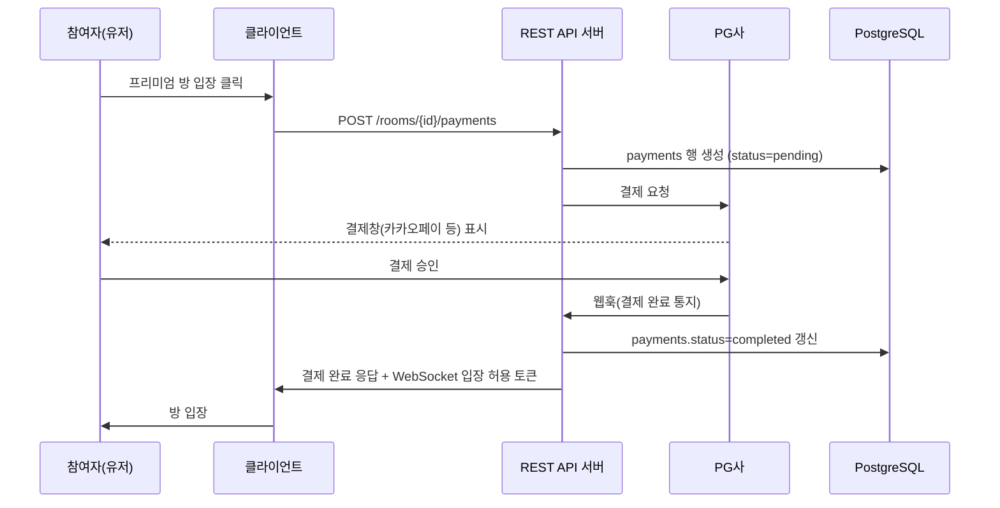

# [결제/정산 설계서] 버즈48 (Buzz48)

> **버전**: v1.0 | **작성일**: 2026-07-03 | **기반 문서**: PRD v1.0 §9, API 명세서 v1.0 §2.5, DB 설계서 v1.0 §3.4
> **⚠️ 선행 조건**: 본 문서의 §2(재화 구조)는 법무 체크리스트 §1의 전자금융거래법 검토 결과에 따라 변경될 수 있습니다. 변호사 검토 전까지는 **설계 초안으로만 활용**하고 실제 결제 기능 개발은 보류를 권장합니다.

---

## 1. 결제 흐름 개요



---

## 2. 재화 구조 (법무 검토 후 확정 필요)

PRD §9는 "인앱 재화(팝콘/별)" 충전식 모델을 제시했으나, 법무 체크리스트 §1에서 지적한 전자금융거래법 리스크를 고려해 **두 가지 대안**을 함께 설계해둡니다. 변호사 검토 결과에 따라 택일합니다.

### 옵션 A — 충전식 재화 (기획서 원안)
유저가 재화를 미리 충전(선불)하고, 프리미엄 방 입장 시 차감. 잔액이 지갑에 남아있는 구조라 선불전자지급수단 규제 대상 가능성이 높음.

### 옵션 B — 직결제형 (규제 리스크 완화 대안)
재화 충전 단계 없이, 방 입장 시점에 **PG사 결제창으로 즉시 건별 결제**. 결제 즉시 소진되므로 "선불 잔액"이 존재하지 않아 규제 대상에서 제외될 가능성이 있음(단, 변호사 확인 필수).

**본 문서는 옵션 B(직결제형) 기준으로 상세 설계하며, API 명세서 §2.5의 `POST /rooms/{room_id}/payments`도 이 구조를 전제로 작성되어 있습니다.** 옵션 A로 확정될 경우 별도 지갑/충전 API가 추가되어야 합니다.

---

## 3. PG사 연동

### 3.1 PG사 선정 기준

| 후보 | 특징 |
| :--- | :--- |
| 카카오페이 | 국내 유저 접근성 최고, 간편결제 UX 우수 |
| 토스페이먼츠 | 개발자 문서 품질 우수, 다양한 결제 수단 통합 |
| 아임포트(포트원) | 여러 PG사를 하나의 API로 통합 — 초기엔 PG사를 하나로 못 정했을 때 유리 |

**권장**: 초기에는 **포트원(아임포트)**로 시작해 카카오페이·토스 등 여러 결제 수단을 한 번에 붙이고, 트래픽이 커지면 주력 PG사와 직접 계약하는 방식을 권장합니다. 초기 개발 리소스를 아낄 수 있습니다.

### 3.2 결제 요청 시퀀스

1. 클라이언트가 `POST /rooms/{room_id}/payments` 호출 (API 명세서 §2.5)
2. API 서버는 `payments` 테이블에 `status=pending`으로 행을 먼저 생성(멱등키 역할 겸 감사 추적용)
3. PG사 결제 요청 API 호출, 결제창 URL 또는 결제창 렌더링에 필요한 파라미터를 클라이언트에 반환
4. 클라이언트가 결제창에서 결제 진행
5. PG사가 **웹훅**으로 결제 결과를 API 서버에 통지 (§3.3)
6. 웹훅 수신 후 `payments.status`를 `completed`로 갱신, WebSocket 서버에 입장 허용 이벤트 발행

### 3.3 웹훅 처리

```
POST /webhooks/payment-gateway
```

- PG사 서명 검증(HMAC) 필수 — 위조 요청 방지.
- **멱등성 보장**: 동일 `pg_transaction_id`로 중복 웹훅이 올 수 있으므로, 이미 `completed` 상태인 결제는 재처리하지 않고 `200 OK`만 반환.
- 웹훅 처리 실패(DB 오류 등) 시 PG사가 재시도하도록 `5xx` 반환. 단, 이미 처리된 건에 대한 중복 요청은 `200 OK`로 응답해 PG사의 불필요한 재시도를 막는다.

### 3.4 결제 실패 및 재시도

| 상황 | 처리 |
| :--- | :--- |
| 결제창에서 유저가 취소 | `payments.status = 'cancelled'`, WebSocket 입장 불허 |
| PG사 응답 타임아웃 | 클라이언트에 `PAYMENT_FAILED` 반환, `payments` 행은 `pending` 유지 후 5분 뒤 배치가 상태 재확인(PG사 조회 API 호출) → 최종 확정 |
| 결제는 성공했으나 웹훅 유실 | **정합성 배치**가 1시간마다 `pending` 상태로 오래 남은 건을 PG사 API로 재조회하여 보정(웹훅 단일 의존 금지) |

---

## 4. 환불 처리

PRD §9.2 및 법무 체크리스트 §5의 검토 대상 정책을 시스템으로 구현합니다.

### 4.1 자동 환불 트리거

| 트리거 | 환불 비율 | 구현 방식 |
| :--- | :--- | :--- |
| 입장 후 5분 이내, 채팅 미참여 | 100% | 클라이언트에서 `POST /payments/{id}/refund` 호출 시, 서버가 해당 유저의 `messages_archive`에 해당 방 발화 기록이 없는지 확인 후 승인 |
| 방 개설자의 조기 종료(삭제) | 잔여 시간 비례 | 방 삭제 이벤트 발생 시 배치가 해당 방의 모든 `completed` 결제 건을 조회, `(24h - 경과시간)/24h` 비율로 자동 환불 처리 |
| 일반 환불(그 외) | 원칙적 불가 | API 응답 `403 REFUND_NOT_ALLOWED` (법무 확정 후 예외 조건 추가 가능) |

### 4.2 환불 실행

- PG사 환불 API 호출 → 성공 시 `payments.status = 'refunded'` 또는 `'partial_refunded'`, `refund_amount`/`refund_reason` 갱신.
- 환불은 **개설자에게 이미 정산되지 않은 금액에서만** 우선 처리하고, 이미 정산 완료된 건에 대한 환불은 다음 정산 주기에서 차감(§5.3).

---

## 5. 정산 (개설자 지급)

### 5.1 정산 주기

DB 설계서 §3.4의 `settlements` 테이블 기준, **익월 15일 정산, 최소 정산액 1만원 미만은 익익월로 이월**(PRD §9.2).

### 5.2 정산 배치 로직

```
매월 1일: 전월 1일~말일 사이 completed 상태의 payments를 creator_id 기준으로 집계
  → gross_amount = SUM(amount)
  → commission_amount = gross_amount * commission_rate (premium_rooms.commission_rate)
  → net_amount = gross_amount - commission_amount - 해당 기간 환불액
  → settlements 행 생성 (status='pending')

매월 15일: settlements.status='pending' 이면서 net_amount >= 10,000 인 건을 대상으로
  → 개설자 계좌로 실제 이체(수동 또는 PG사 정산 API)
  → 이체 성공 시 status='paid', paid_at 기록
  → net_amount < 10,000 인 건은 status='carried_over' 로 표시, 다음 달 집계에 합산
```

### 5.3 정산 시 환불 차감 처리

이미 정산 완료된 결제 건에 대해 나중에 환불이 발생하면(예: 법적 분쟁으로 인한 소급 환불), 해당 금액을 **다음 정산 주기의 net_amount에서 차감**하는 방식으로 처리한다. 개설자 계좌에서 직접 회수하지 않는다(환불 처리 복잡도를 낮추기 위함).

---

## 6. 보안 및 감사

- 모든 결제·환불·정산 트랜잭션은 `payments`, `settlements` 테이블에 불변 로그로 남기며, 수정이 아닌 새 행 추가로 상태 변화를 추적(감사 추적성 확보).
- PG사 웹훅 엔드포인트는 IP 화이트리스트 + HMAC 서명 검증 이중 방어.
- 결제 금액 조작 방지: 클라이언트가 금액을 직접 전달하지 않고, 서버가 `premium_rooms.entry_price`를 조회하여 PG사에 전달(요청 위변조 방지).

---

## 7. 다음 문서와의 연결

- 본 문서의 §2 재화 구조 결정 → 법무 체크리스트 §1 검토 완료 후 API 명세서 §2.5, DB 설계서 §3.4 수정 필요 여부 확정
- §3.4, §5.2 배치 로직 → **인프라/운영 문서**의 배치 스케줄링·모니터링 설계 근거
