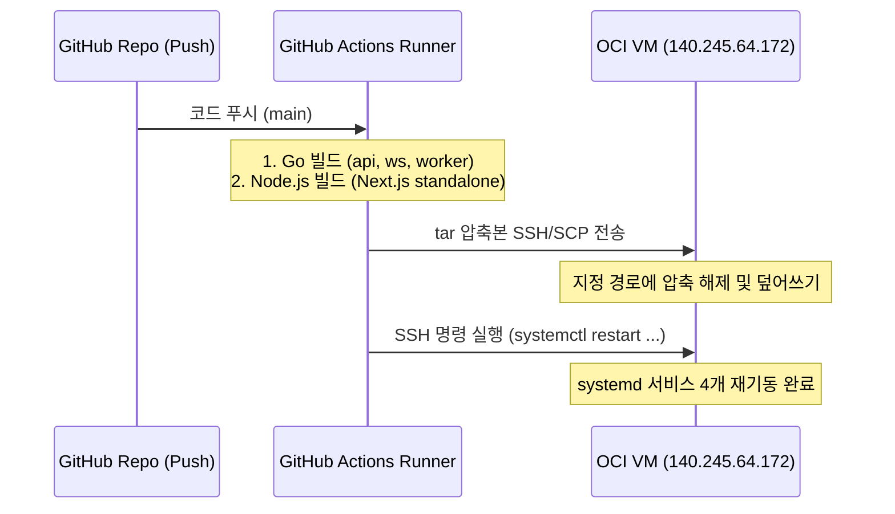
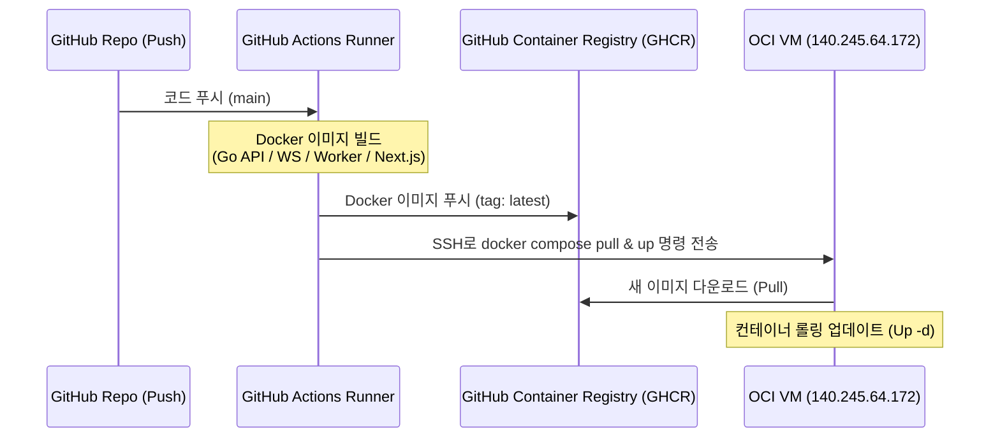

# 오라클 클라우드 VM (140.245.64.172) 자동 배포 (CI/CD) 방안 제안

본 문서는 오라클 클라우드(OCI) 우분투 VM 환경에 **Buzz48** 서비스(Go API, WebSocket, Worker 및 Next.js 프론트엔드)를 자동으로 배포하기 위한 최적의 CI/CD 파이프라인 구성 방안을 제안합니다.

현재 [인프라운영 문서](file:///h:/lee/buzz48/docs/07_인프라운영_문서.md) 및 [배포 가이드](file:///h:/lee/buzz48/docs/deployment_guide.md)의 구성을 기반으로, 가장 현실적이고 안정적인 **두 가지 자동 배포 옵션**을 비교 및 제공합니다.

---

## 🚀 자동 배포 핵심 고려사항

1. **서버 리소스 제약 (OOM 방지)**:
   * 오라클 클라우드 Always Free AMD 인스턴스(1 Core, 1GB RAM)를 사용하는 경우, 서버 내부에서 `npm run build`를 실행하면 메모리 부족(OOM)으로 서버가 다운되거나 빌드가 실패합니다.
   * 따라서 **컴파일 및 빌드 과정(Go 빌드, Next.js 빌드)은 GitHub Actions Runner(무상태 가상 머신)에서 전적으로 수행**하고, 결과물(빌드 아티팩트 또는 Docker 이미지)만 서버에 전송하는 방식을 강력히 권장합니다.
2. **네트워크 보안 (Cloudflare Tunnel 유지)**:
   * Cloudflare Tunnel을 사용하고 있으므로 OCI 보안 그룹에서 80, 443 등의 포트를 열 필요가 없습니다. SSH 포트(`22` 또는 변경된 커스텀 SSH 포트)만 GitHub Actions IP 또는 특정 환경에 열려있으면 배포가 가능합니다.

---

## 💡 옵션 1: GitHub Actions + SSH Deploy (기존 systemd 유지 방식)

기존 [배포 가이드](file:///h:/lee/buzz48/docs/deployment_guide.md)에서 사용 중인 systemd 서비스 유닛(`buzz-api`, `buzz-ws`, `buzz-worker`, `buzz-frontend`) 구조를 그대로 유지하면서, GitHub Actions를 통해 빌드본만 SSH로 전송하고 서비스를 재시작하는 방식입니다.

### 📋 흐름도 (Workflow)


### 🛠️ 구현 단계

#### 1. Next.js 빌드 최적화 (`output: 'standalone'`)
Next.js 빌드 결과물 크기를 최소화하여 전송 속도를 높이기 위해 [next.config.ts](file:///h:/lee/buzz48/frontend/next.config.ts)에 `output: 'standalone'` 설정을 추가하는 것이 좋습니다.
이렇게 하면 프로덕션 실행에 필요한 최소한의 파일만 `.next/standalone`에 모이게 됩니다.

#### 2. GitHub Actions 워크플로우 작성
`.github/workflows/deploy.yml` 파일을 작성하여 자동 빌드 및 배포를 구성합니다.

```yaml
name: Buzz48 CD - SSH Deploy

on:
  push:
    branches: [ "main" ]

jobs:
  deploy:
    runs-on: ubuntu-latest
    steps:
      - name: Checkout code
        uses: actions/checkout@v4

      # ================= Clean & Build Backend =================
      - name: Set up Go
        uses: actions/setup-go@v5
        with:
          go-version: '1.21'
          cache-dependency-path: backend/go.sum

      - name: Build Go Binaries
        run: |
          cd backend
          # VM의 CPU 아키텍처에 맞춰 빌드 (AMD64인 경우 amd64, ARM Ampere인 경우 arm64로 변경)
          GOOS=linux GOARCH=amd64 go build -ldflags="-w -s" -o api-server api/main.go
          GOOS=linux GOARCH=amd64 go build -ldflags="-w -s" -o ws-server ws/main.go
          GOOS=linux GOARCH=amd64 go build -ldflags="-w -s" -o worker-server cmd/worker/main.go

      # ================= Clean & Build Frontend =================
      - name: Set up Node.js
        uses: actions/setup-node@v4
        with:
          node-version: '20'
          cache-path: frontend/package-lock.json

      - name: Build Next.js
        env:
          NEXT_PUBLIC_API_URL: https://buzz48.pl3.kr
          NEXT_PUBLIC_WS_URL: wss://buzz48.pl3.kr/ws
        run: |
          cd frontend
          npm ci
          npm run build

      # ================= Package and Transfer =================
      - name: Create Deploy Package
        run: |
          mkdir -p deploy/backend deploy/frontend
          # 백엔드 바이너리 복사
          cp backend/api-server deploy/backend/
          cp backend/ws-server deploy/backend/
          cp backend/worker-server deploy/backend/
          
          # 프론트엔드 standalone 빌드 결과물 복사
          # standalone 모드인 경우 .next/standalone 폴더 아래에 실행 코드가 집중됩니다.
          cp -r frontend/.next/standalone/* deploy/frontend/
          cp -r frontend/public deploy/frontend/public
          # .next/static 폴더는 standalone에 누락되므로 수동 복사 필요
          mkdir -p deploy/frontend/.next
          cp -r frontend/.next/static deploy/frontend/.next/static
          
          # 전송용 tar 압축
          tar -czf deploy.tar.gz -C deploy .

      - name: Deploy to OCI VM via SSH/SCP
        uses: appleboy/scp-action@master
        with:
          host: 140.245.64.172
          username: ubuntu
          key: ${{ secrets.SSH_PRIVATE_KEY }}
          port: 22
          source: "deploy.tar.gz"
          target: "/var/www/buzz48/tmp"

      - name: Execute Remote SSH Commands
        uses: appleboy/ssh-action@master
        with:
          host: 140.245.64.172
          username: ubuntu
          key: ${{ secrets.SSH_PRIVATE_KEY }}
          port: 22
          script: |
            # 임시 폴더에서 배포 경로로 복사 및 적용
            mkdir -p /var/www/buzz48/backend
            mkdir -p /var/www/buzz48/frontend
            
            tar -xzf /var/www/buzz48/tmp/deploy.tar.gz -C /var/www/buzz48/tmp
            
            # 백엔드 교체 (실행 중인 파일 덮어쓰기 에러 방지를 위해 정지 후 이동 혹은 덮어쓰기 기법 사용)
            sudo systemctl stop buzz-api buzz-ws buzz-worker || true
            cp /var/www/buzz48/tmp/backend/* /var/www/buzz48/backend/
            chmod +x /var/www/buzz48/backend/*-server
            
            # 프론트엔드 교체
            sudo systemctl stop buzz-frontend || true
            # 기존 프론트 파일 백업/삭제 후 새 파일 적용
            rm -rf /var/www/buzz48/frontend/*
            cp -r /var/www/buzz48/tmp/frontend/* /var/www/buzz48/frontend/
            
            # 클린업
            rm -rf /var/www/buzz48/tmp/*
            
            # 서비스 시작
            sudo systemctl start buzz-api buzz-ws buzz-worker buzz-frontend
            
            # 상태 확인
            sudo systemctl status buzz-api buzz-ws buzz-worker buzz-frontend --no-pager
```

> [!NOTE]
> **systemd 서비스 실행 파일 변경 필요**:
> Next.js의 `standalone` 모드를 활성화한 경우, 서비스의 `ExecStart`는 `npm run start` 대신 최적화된 독립 실행 스크립트인 `node server.js`를 사용하도록 구성하는 것이 리소스를 아끼고 속도를 높이는 정석입니다.
> `/etc/systemd/system/buzz-frontend.service` 의 `ExecStart` 수정 제안:
> ```ini
> ExecStart=/usr/bin/node /var/www/buzz48/frontend/server.js
> Environment=PORT=3001
> ```

---

## 🐳 옵션 2: GitHub Actions + Docker Compose (권장 방식)

서버 내부의 라이브러리 오염을 원천 차단하고 완전 무상태(Stateless)로 관리하는 **컨테이너 기반 자동 배포 방식**입니다. GitHub Container Registry (GHCR)에 빌드된 이미지를 푸시하고, VM에서는 `docker compose pull && docker compose up -d` 명령어만 실행합니다.

### 📋 흐름도 (Workflow)


### 🛠️ 구현 단계

#### 1. Dockerfile 작성

##### 백엔드 멀티스테이지 Dockerfile (`backend/Dockerfile`)
```dockerfile
# 1. 빌드 스테이지
FROM golang:1.21-alpine AS builder
WORKDIR /app
COPY go.mod go.sum ./
RUN go mod download
COPY . .
RUN CGO_ENABLED=0 GOOS=linux go build -ldflags="-w -s" -o api-server api/main.go
RUN CGO_ENABLED=0 GOOS=linux go build -ldflags="-w -s" -o ws-server ws/main.go
RUN CGO_ENABLED=0 GOOS=linux go build -ldflags="-w -s" -o worker-server cmd/worker/main.go

# 2. 실행 스테이지
FROM alpine:3.19
WORKDIR /app
COPY --from=builder /app/api-server .
COPY --from=builder /app/ws-server .
COPY --from=builder /app/worker-server .
# 환경 변수 바인딩용 템플릿 등 복사 필요 시 추가
EXPOSE 8082 8081
```

##### 프론트엔드 멀티스테이지 Dockerfile (`frontend/Dockerfile`)
```dockerfile
# 1. 의존성 설치 스테이지
FROM node:20-alpine AS deps
WORKDIR /app
COPY package.json package-lock.json ./
RUN npm ci

# 2. 빌드 스테이지
FROM node:20-alpine AS builder
WORKDIR /app
COPY --from=deps /app/node_modules ./node_modules
COPY . .
ENV NEXT_TELEMETRY_DISABLED=1
ENV NEXT_PUBLIC_API_URL=https://buzz48.pl3.kr
ENV NEXT_PUBLIC_WS_URL=wss://buzz48.pl3.kr/ws
RUN npm run build

# 3. 실행 스테이지
FROM node:20-alpine AS runner
WORKDIR /app
ENV NODE_ENV=production
ENV PORT=3001
ENV HOSTNAME="0.0.0.0"

COPY --from=builder /app/public ./public
COPY --from=builder /app/.next/standalone ./
COPY --from=builder /app/.next/static ./.next/static

EXPOSE 3001
CMD ["node", "server.js"]
```

#### 2. `docker-compose.yml` 작성
OCI VM의 `/var/www/buzz48/docker-compose.yml` 파일에 구성할 내용입니다.

```yaml
version: '3.8'

services:
  # Redis (기존 운영 중인 Redis 대체 또는 통합)
  redis:
    image: redis:7-alpine
    container_name: buzz-redis
    ports:
      - "6379:6379"
    restart: always
    volumes:
      - redis_data:/data

  # Go API 서버
  api:
    image: ghcr.io/${GITHUB_REPOSITORY_OWNER}/buzz-backend:latest
    container_name: buzz-api
    command: ./api-server
    ports:
      - "8082:8082"
    restart: always
    env_file:
      - ./backend/.env
    depends_on:
      - redis

  # Go WebSocket 서버
  ws:
    image: ghcr.io/${GITHUB_REPOSITORY_OWNER}/buzz-backend:latest
    container_name: buzz-ws
    command: ./ws-server
    ports:
      - "8081:8081"
    restart: always
    env_file:
      - ./backend/.env
    depends_on:
      - redis

  # Go 배치 워커
  worker:
    image: ghcr.io/${GITHUB_REPOSITORY_OWNER}/buzz-backend:latest
    container_name: buzz-worker
    command: ./worker-server
    restart: always
    env_file:
      - ./backend/.env
    depends_on:
      - redis

  # Next.js 프론트엔드
  frontend:
    image: ghcr.io/${GITHUB_REPOSITORY_OWNER}/buzz-frontend:latest
    container_name: buzz-frontend
    ports:
      - "3001:3001"
    restart: always

volumes:
  redis_data:
```

#### 3. GitHub Actions 워크플로우 작성 (`.github/workflows/deploy-docker.yml`)
```yaml
name: Buzz48 CD - Docker Deploy

on:
  push:
    branches: [ "main" ]

env:
  REGISTRY: ghcr.io
  IMAGE_BACKEND: ghcr.io/${{ github.repository_owner }}/buzz-backend
  IMAGE_FRONTEND: ghcr.io/${{ github.repository_owner }}/buzz-frontend

jobs:
  build-and-push:
    runs-on: ubuntu-latest
    permissions:
      contents: read
      packages: write
    steps:
      - name: Checkout code
        uses: actions/checkout@v4

      - name: Log in to GitHub Container Registry
        uses: docker/login-action@v3
        with:
          registry: ${{ env.REGISTRY }}
          username: ${{ github.actor }}
          password: ${{ secrets.GITHUB_TOKEN }}

      # (선택사항) ARM VM인 경우 QEMU/Buildx를 사용해 multi-platform 빌드 가능
      # 단, 항상 프리 ARM 인스턴스인 경우 배포 대상에 맞춰 buildx 추가 세팅을 권장합니다.

      - name: Build and Push Backend Image
        uses: docker/build-push-action@v5
        with:
          context: ./backend
          file: ./backend/Dockerfile
          push: true
          tags: ${{ env.IMAGE_BACKEND }}:latest,${{ env.IMAGE_BACKEND }}:${{ github.sha }}

      - name: Build and Push Frontend Image
        uses: docker/build-push-action@v5
        with:
          context: ./frontend
          file: ./frontend/Dockerfile
          push: true
          tags: ${{ env.IMAGE_FRONTEND }}:latest,${{ env.IMAGE_FRONTEND }}:${{ github.sha }}

  deploy:
    needs: build-and-push
    runs-on: ubuntu-latest
    steps:
      - name: Execute remote docker-compose via SSH
        uses: appleboy/ssh-action@master
        with:
          host: 140.245.64.172
          username: ubuntu
          key: ${{ secrets.SSH_PRIVATE_KEY }}
          port: 22
          script: |
            cd /var/www/buzz48
            # GitHub 패키지 레지스트리 로그인
            echo "${{ secrets.GITHUB_TOKEN }}" | docker login ghcr.io -u ${{ github.actor }} --password-stdin
            
            # 최신 이미지 풀링 및 컨테이너 리스타트
            docker compose pull
            docker compose up -d --remove-orphans
            
            # 미사용 이미지 정리 (디스크 방지)
            docker image prune -f
```

---

## ⚖️ 옵션 비교 및 추천

| 비교 항목 | 옵션 1: SSH Deploy (systemd) | 옵션 2: Docker Compose (권장) |
| :--- | :--- | :--- |
| **서버 환경 의존성** | 서버에 Node, Go, systemd, tar 설치 필요 | 서버에 Docker, Docker Compose만 필요 |
| **빌드 안정성** | 로컬 및 러너 버전 매칭 불일치 시 오작동 가능 | 컨테이너 내부 환경 통일로 100% 동일 동작 보장 |
| **서버 메모리 부하** | 바이너리 복사 및 서비스 재시작으로 부하 적음 | 컨테이너 기동 메모리 필요 (1GB RAM의 경우 Swap 필수 설정 권장) |
| **운영 유연성** | 롤백을 위해 수동 바이너리 교체 필요 | `docker-compose.yml` 이미지 태그 수정만으로 100% 롤백 가능 |
| **유지 관리 편의성** | 서비스 4개의 systemd 유닛 개별 관리 필요 | 단 하나의 `docker-compose.yml` 파일로 통합 관리 |

### 💡 최종 추천 로드맵
1. 현재 OCI 우분투 VM 사양이 **ARM Ampere(4 Cores, 24GB RAM)** 환경이거나, **AMD (1 Core, 1GB RAM)에 Swap 메모리(2~4GB)**가 잡혀있는 상태라면 **[옵션 2: Docker Compose]** 방식을 가장 추천합니다. 환경 변경이 매우 깨끗하고 추후 AWS 인프라(Fargate, ECS 등)로의 확장 시에도 Dockerfile을 그대로 재사용할 수 있습니다.
2. 만약 Docker 학습 코스트를 지양하고 기존에 구축된 systemd 서비스와 로그 모니터링 체계를 그대로 유지하고 싶다면 **[옵션 1: SSH Deploy]** 방식으로 빠르게 자동화를 구축하시는 것이 편리합니다.
